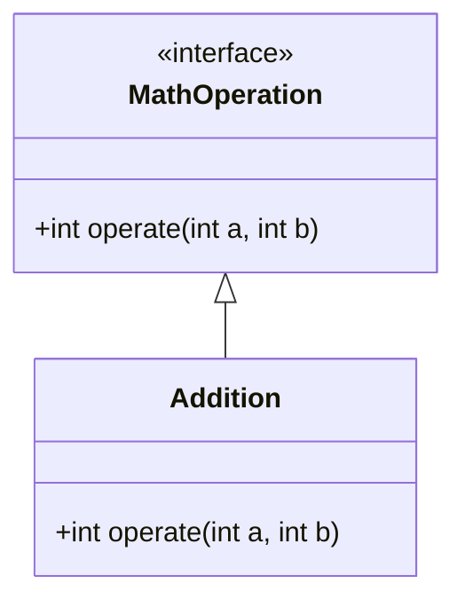
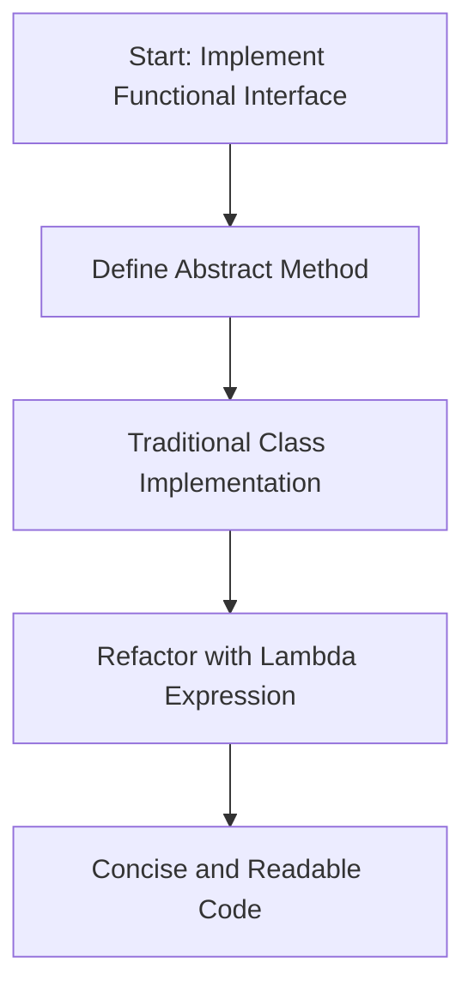
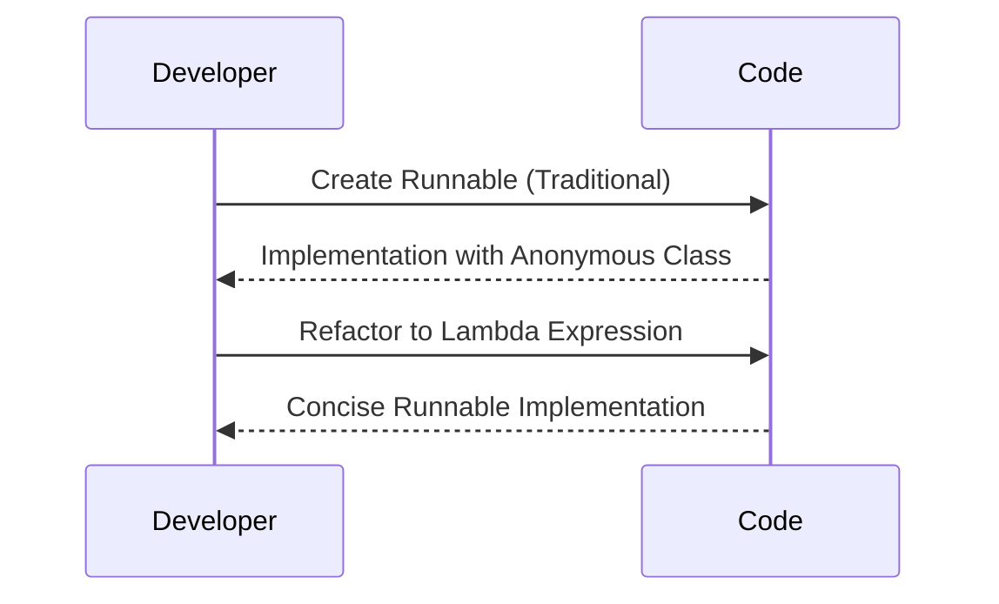
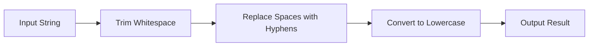

[](https://classroom.github.com/open-in-codespaces?assignment_repo_id=22818823)
# Lab: Introduction to Lambda Expressions in Java

## Agenda
- [Objective](#objective)
- [Part 1: Understanding Interfaces](#part-1-understanding-interfaces)
  - [What is an Interface?](#what-is-an-interface)
  - [Example: Creating and Using an Interface](#example-creating-and-using-an-interface)
  - [DIY: Create Your Own Interface](#diy-create-your-own-interface)
- [Part 2: Moving to Lambda Expressions](#part-2-moving-to-lambda-expressions)
  - [What is a Lambda Expression?](#what-is-a-lambda-expression)
  - [Syntax of a Lambda Expression](#syntax-of-a-lambda-expression)
  - [Example: Using a Lambda Expression](#example-using-a-lambda-expression)
  - [DIY: Refactor with Lambdas](#diy-refactor-with-lambdas)
- [Part 3: Benefits of Lambda Expressions](#part-3-benefits-of-lambda-expressions)
  - [Example: Simplifying Threads with Lambdas](#example-simplifying-threads-with-lambdas)
  - [DIY: Simplify Runnable](#diy-simplify-runnable)
- [Part 4: Putting It All Together](#part-4-putting-it-all-together)
  - [Example: Combining Operations](#example-combining-operations)
  - [DIY: Practice Lambda Chaining](#diy-practice-lambda-chaining)
- [Summary](#summary)

## Objective
This lab will introduce you to the concept of lambda expressions in Java. We’ll start by understanding what interfaces are, work with a basic example, and then move towards creating and using lambda expressions.

By the end of this lab, you should be able to:
1. Understand the purpose of interfaces in Java.
2. Create your own interface with a single abstract method.
3. Write and use lambda expressions to simplify code.
4. Put it all together.

## Part 1: Understanding Interfaces

### What is an Interface?
An interface in Java is a reference type, similar to a class, that can contain only constants, method signatures, default methods, static methods, and nested types. It is used to specify a behavior that classes must implement. Interfaces cannot have method implementations (except for default and static methods) and are typically used to achieve abstraction and multiple inheritance in Java.

### Example: Creating and Using an Interface
In the `src` folder, create a package called `ie.atu.lambda`. Inside this package, create a simple interface called `MathOperation` with a single method `operate`:

```java
// Define the interface
interface MathOperation {
    int operate(int a, int b); // Single abstract method
}
```

Next, create a class called `Addition`.

```java
// Implement the interface using a class
class Addition implements MathOperation {
    public int operate(int a, int b) {
        return a + b;
    }
}
```

Finally, create a class called `Main`. Add the `main` method. Create an instance of the MathOperation interface using the Addition class. Finally, call the `operate` method of the `addition` object and print the result.

```java
public class Main {
    public static void main(String[] args) {
        MathOperation addition = new Addition();
        System.out.println("Addition: " + addition.operate(5, 3));
    }
}
```

#### Diagram: Relationship Between Interface and Implementation



### DIY: Create Your Own Interface
1. **Create a new interface** named `StringOperation` with a single abstract method `apply` that takes a single `String` parameter and returns a `String`.
3. **Create a class** called `UpperCaseConverter` that implements `StringOperation` and overrides the `apply` method to convert the input string to uppercase.
4. **Test it** by creating an instance of `UpperCaseConverter` in your `main` method and calling the `apply` method with a string of your choice.

## Part 2: Moving to Lambda Expressions

### What is a Lambda Expression?
A lambda expression is a shorter way to implement a functional interface (an interface with only one abstract method). It allows you to create anonymous methods and can be used to simplify the code. In essence, lambda expressions are a way to represent instances of functional interfaces more concisely.

### Syntax of a Lambda Expression
The basic syntax is:

```java
(parameters) -> {body}
```

### Example: Using a Lambda Expression
Let’s refactor our `MathOperation` example using a lambda expression:

```java
public class Main {
    public static void main(String[] args) {
        // Using a lambda expression instead of implementing the interface via a class
        MathOperation addition = (a, b) -> a + b;
        System.out.println("Addition: " + addition.operate(5, 3));
    }
}
```

#### Diagram: Workflow of Refactoring to Lambda Expressions



### Explanation
In the above example:
- The lambda expression `(a, b) -> a + b` is used to define the `operate` method of the `MathOperation` interface.
- It takes two parameters (`a` and `b`) and returns their sum.

### DIY: Refactor with Lambdas
1. Refactor your `StringOperation` interface from Part 1 to use a lambda expression in the `main` method.
2. Replace the implementation of `ToUpperCase` with a lambda that converts the string to uppercase.

## Part 3: Benefits of Lambda Expressions

Lambda expressions make your code shorter and more readable. They are particularly useful in:
1. Reducing boilerplate code for single-method interfaces.
2. Writing more expressive and functional-style code.

### Example: Simplifying Threads with Lambdas

Consider creating and starting a new thread in Java. Traditionally, you might do this:

```java
public class Main {
    public static void main(String[] args) {
        // Traditional way using an anonymous class
        Runnable task = new Runnable() {
            public void run() {
                System.out.println("Thread is running");
            }
        };
        
        Thread thread = new Thread(task);
        thread.start();
    }
}
```

Using a lambda expression, you can simplify this code:

```java
public class Main {
    public static void main(String[] args) {
        // Using a lambda expression
        Runnable task = () -> System.out.println("Thread is running");
        
        Thread thread = new Thread(task);
        thread.start();
    }
}
```

#### Diagram: Simplifying Runnable with Lambdas



### Explanation

In the above example:
- The `Runnable` interface is a functional interface with a single abstract method `run()`.
- We replaced the anonymous inner class with a lambda expression `() -> System.out.println("Thread is running")`.
- This makes the code more concise and easier to read.

### DIY: Simplify Runnable

1. **Create a `Runnable` instance** using a lambda expression that prints "Hello from the thread".
2. **Start a new thread** with this `Runnable`.
3. **Observe the output** to ensure your thread is running as expected.

## Part 4: Putting It All Together

Let’s build a final example that combines multiple lambda expressions. Here we will use a Java inbuilt functional interface called `Function`. It can take one argument and produces a result.

### Example: Combining Operations

```java
import java.util.function.Function;

public class Main {
    public static void main(String[] args) {
        // Define a lambda to reverse a string. Function<String, String> defines a function that takes a String as input and returns a String as output
        Function<String, String> reverse = s -> new StringBuilder(s).reverse().toString();

        // Define a lambda to convert a string to uppercase
        Function<String, String> toUpperCase = s -> s.toUpperCase();

        // Combine lambdas
        Function<String, String> combinedOperation = reverse.andThen(toUpperCase);

        // Apply the combined operation
        System.out.println("Result: " + combinedOperation.apply("Lambda"));
    }
}
```

#### Diagram: Lambda Chaining Process



### Explanation

In this example:
- We used `Function<String, String>` to define lambdas that reverse a string and convert it to uppercase.
- We combined these operations using `andThen` to create a new operation.
- The `andThen` method executes the first function and passes its result to the second function.

### DIY: Practice Lambda Chaining

1. **Create a `Function<String, String>` instance** that trims spaces from a string.
2. **Combine it** with a lambda that converts the string to lowercase.
3. **Test the combined operation** on a string of your choice.

## Summary

In this lab, you:

1. Learned what interfaces are and how to create them.
2. Explored lambda expressions and their syntax.
3. Refactored code to use lambdas for conciseness.
4. Practiced using lambdas with threads and custom functional interfaces.
5. Experimented with chaining lambdas to create more complex operations.

Keep experimenting with lambda expressions to get comfortable with their syntax and usage in various scenarios!

---

**End of Lab**
